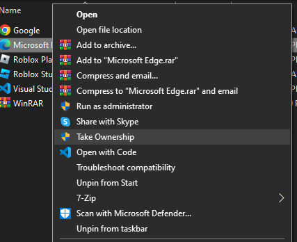

# 🛠️ Take Ownership Context Menu Tweak for Windows 10/11

Easily add or remove a **"Take Ownership"** option to the right-click context menu for files and folders in Windows. Useful for regaining control of locked files and deleting protected content.

---

## 📂 Table of Contents

- [Files Included](#files-included)
- [How to Use](#how-to-use)
  - [Add "Take Ownership"](#add-take-ownership)
  - [Remove "Take Ownership"](#remove-take-ownership)
- [Safety and Requirements](#safety-and-requirements)
- [Supported Versions](#supported-versions)
- [Download](#download)
- [License](#license)

---

## 📁 Files Included

- `TakeOwnership.reg` – Adds the "Take Ownership" option
- `RemoveTakeOwnership.reg` – Removes the option
- `README.txt` – Usage instructions (optional if you're reading this)

---

## ⚙️ How to Use

### ➕ Add "Take Ownership"

1. Right-click `TakeOwnership.reg`
2. Click **Merge**
3. Confirm the prompts

This adds a right-click option for files and folders that runs `takeown` and `icacls` under the hood.

### ➖ Remove "Take Ownership"

1. Right-click `RemoveTakeOwnership.reg`
2. Click **Merge** to remove the context menu item

---

## 🛡️ Safety and Requirements

- Uses built-in Windows commands (`takeown` & `icacls`)
- Requires administrator privileges
- No third-party software needed

---

## ✅ Supported Versions

- Windows 10 Pro (21H2)
- Windows 11 (22H2)

---

## 📦 Download

You can download the entire project as a ZIP file:

[Download ZIP](https://github.com/CodeReefByte/windows-take-ownership-tweak/archive/refs/heads/main.zip)

---

## 📜 License

This project is licensed under the [MIT License](LICENSE).
